# Tax-Aide Activity Logging and Tax Return Tracking System : User Manual
## 🗺️ Chapter 1: System Overview & General Concepts
### 1.1 Purpose of the System

Welcome to the AARP Tax-Aide Activity Logging and Tax Return Tracking System, a multi-site system designed as a collaborative tool for all AARP Tax-Aide volunteers engaged in providing tax preparation services. The primary goal in developing this system was to make the management and tracking of the tax preparation process at all Tax-Aide sites easy and error-free compared with activity logging systems used today, while providing leadership at the site and district level with real-time status of the tax returns prepared by AARP Tax-Aide volunteers.

The system logs, tracks, documents and archives all activities of the tax preparation process from taxpayers' appointments and check-in to the successful filing of their tax return, recording all steps taken during this process by all volunteers as well as all exceptions that occur while providing tax preparation services to thousand of clients.

The system supplements rather than replaces the limited status logging features provided by TaxSlayer, enabling AARP Tax-Aide volunteers to better manage the workflow during the tax filing season.

### 1.2 User Roles and Responsibilities

All AARP Tax-Aide volunteers engaged in providing tax preparation services access and collaborate by using the system. Those include:
* Client Facilitators (Greeters)
* Tax Counselors
* Quality Reviewers
* Shift Coordinators
* Local Coordinators (site leaders)
* District Administrator
* District Coordinator

This user manual will address the responsibilities of each of these roles and the procedures to be used by each.

### 1.3 Accessing the Google Workspace

The system is based on the AARP-provided Google Workplace using Google Sheets that embed Apps Scripts (GAS).

After logging into their Chromebook in the normal manner, the volunteer launches the system using the "Activity Logging" link provided on the Chrome browser's bookmark bar. No additional login is required.

In some cases the Google Workspace will require the user to go through  a one-time procedure that enables the user to run the scripts associated with the system operation. If this occurs, please consult the District Technology Coordinator who will walk you though the procedure of providing such permission.

The system can also be accessed from a user's PC, provided that the network being used meets AARP Tax-Aide's security requirements. Please consult the District Technology Coordinator if you wish to access the system from a non-AARP network.

### 1.4 The Tax Preparation Workflow

The overall process tracked by the system during a Tax-Aide shift is depicted in Figure 1.

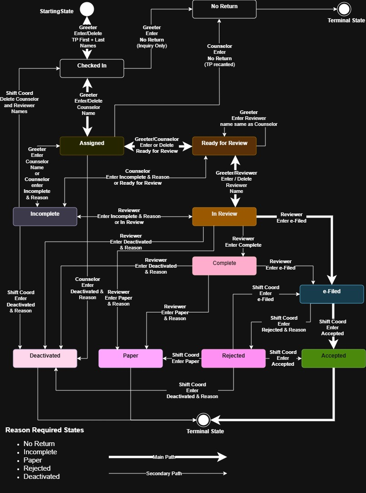

<b>Figure 1 - The Tax Preparation Workflow</b>

The diagram shows all possible states of a tax return as well as all permitted transitions from one state to the next. Transitions that are not shown by connections are deemed invalid. The workflow represented by this diagram is typical of all Tax-Aide sites that operate in the traditional, in-person service model. It is not designed for other service delivery models offered by the AARP Tax-Aide program.

At sites that operate by appointment, there is a preliminary process of transferring the daily appointments from the AARP Session Management or other appointment-making system into the Tax-Aide Activity Logging and Tax Return Tracking System. This process will be described later in this manual.

An additional process, executed at the end of a day's shift deals with the archiving of completed and uncompleted tax returns.

The process begins by the taxpayer reporting to the Tax-Aide tax preparation site and met by a greeter (Support or Client Facilitator in AARP-speak) who checks them in by validating their identity and entering their information into the system. It always ends in one of four "terminal" states from which the system will not permit further transition. Those are:

* **Accepted:** A tax return that was electronically filed (e-filed) and accepted by the IRS.
* **Paper:** A tax return that was prepared for the taxpayer to be filed by mail. A paper tax return is never e-filed.
* **Deactivated:** A tax return that was deactivated in the TaxSlayer system.
* **No Return:** The taxpayer and/or the Tax-Aide volunteer decided not to begin the process of preparing a tax return. A No Return means that a tax return was not begun in TaxSlayer.

All other states are various stages of an incomplete tax preparation process and include:

* **Checked In:** A taxpayer has checked in and is waiting for their return to be prepared by a counselor.
* **Assigned:** The tax return is assigned to a counselor and is in the process of being prepared.
* **Ready for Review:** The tax return preparation by a counselor was completed and is ready to be reviewed by a quality reviewer.
* **In Review:** The tax return is in the process of being reviewed by a quality reviewer.
* **Complete:** The tax return has been completed and reviewed, but has not yet been e-filed or provided to the taxpayer in paper form.
* **e-Filed:** The tax return was electronically filed with the IRS.
* **Rejected:** The electronically filed tax return has been rejected by the IRS.
* **Incomplete:** The tax return is incomplete, is not actively being prepared or reviewed and awaiting further action by a taxpayer and/or a tax-Aide volunteer.

For the following states the system enforces stating a reason for the tax return being assigned this state by popping up a form as in Figure 2. The reason may be a combination of a preset, typical reason and/or free text entered by the operator. The reason will be recorded in the comments section of the tax return record. This requirement is important for maintaining communications amongst volunteers regarding the state of the tax return, as it may be handled by several volunteers with different roles over the course of several days. It may also be important in cases where a review of an interaction between taxpayers and volunteers are necessary.

* **Rejected**
* **Incomplete**
* **No Return**
* **Deactivated**
* **Paper**

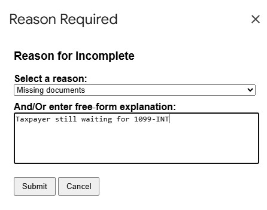

<b>Figure 2 - The Reason Required Form</b>

### 1.5 Status Tracking

It is important to note that the system keeps track of every transition from one state to another. It does so in a background process which is not visible by the system operators. The information gathered by status tracking is processed and displayed on the system's dashboard in a variety of ways.

## 🗺️ Chapter 2: The Check In Process

### 2.1  Checking In Scheduled Taxpayers

This section is only applicable to sites who operate by appointment.

Prior to the daily session, a Session Management Coordinator populates the Appointments tab of the system with the day's appointments. This process will be described later in this manual. The Appointments tab is shown in Figure 2.

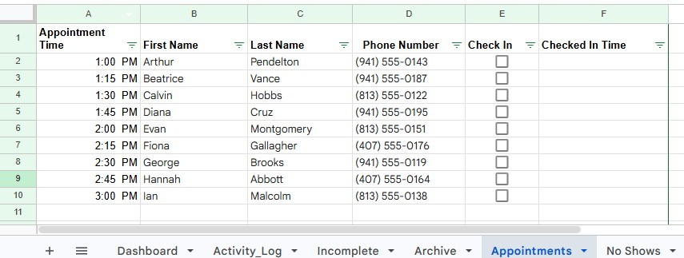

<b>Figure 3 -The Appointment Tab</b>

When a taxpayer is welcomed at the tax preparation site, the greeter confirms the taxpayer's identity and checks the checkbox next to the taxpayer name (column E). The system will then timestamp the taxpayer's arrival date and time and transfer the tax return record to the Activity Log tab and confirm as follows:

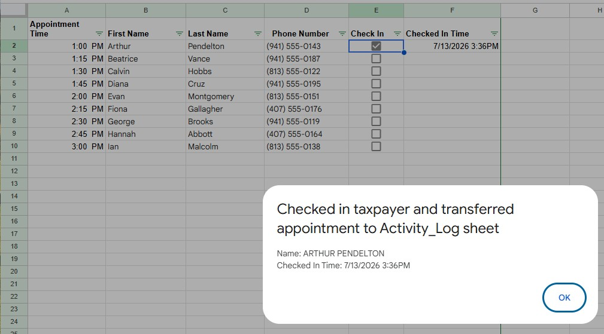

<b>Figure 4 -Checked In Confirmation</b>

After transferring the record to the Activity Log tab, the system will delete the appointment record from the Appointment tab. The fields transferred to the Activity Log tab include the taxpayer's first and last names (capitalized) and the time they checked in. The system then focuses on the row in the Appointment tab to which the appointment was transferred. The greeter may then add the primary taxpayer's last 4 digits of their Social Security number, if required by the site leadership. The system enters the tax year which by default is the current tax year (e.g 2026 for tax returns prepared in early 2027). The volunteer may choose a different tax year from the dropdown. If the taxpayer wishes to prepare tax returns for more than one year, the greeter should enter each year as a separate record, as each tax return is tracked separately.

A note about "no-shows". If at the end of the day's session a taxpayer still did not show up for their appointment, the greeter should leave the check-in box on the Appointments tab blank. The Shift Coordinator will purge un-executed appointments after the end of the daily session. More on that later in the manual.

### 2.2  Handling Walk-In Taxpayers

At sites operating on a first-come / first served basis or appointment sites that accept walk-in taxpayers, the greeter enters the taxpayer's information directly into the Activity_Log tab. This information includes:

* First name(s) (mandatory)
* Last name(s) (mandatory)
  * If the tax return is being prepared for married couples, enter the first and last names of the primary taxpayer.
* As soon as the first and last names are entered into the Activity_Log tab, the system records the Check In Time and set the Status of the return to "Checked In".
  * The system also starts a duration counter, updated every minute, counting the time the taxpayer is being processed.
* The last 4 digits of the primary taxpayer's Social Security number
  * If required by the site leadership.
  * Inclusion or exclusion of the SSN Last 4 column on the Activity_Log tab is controlled by the site's settings.
* Ticket #
  * Ticket numbers are used at walk-in sites to control the first-come/first-served queuing system
  * Inclusion or exclusion of the Ticket # column on the Activity_Log tab is controlled by the site's settings.
* Tax Year
   * By default, the system enters the current tax year. A volunteer may change the tax year to any of the tax years permitted.
   * When a taxpayer request preparation of more than one year of tax returns, every year must be entered as a separate record.

Once the taxpayer's first and last names are entered into the Activity Log tab, the system will capitalize the taxpayer's first and last name, timestamp the check in time and set the status of the return to **Checked In**. See Figure 5.

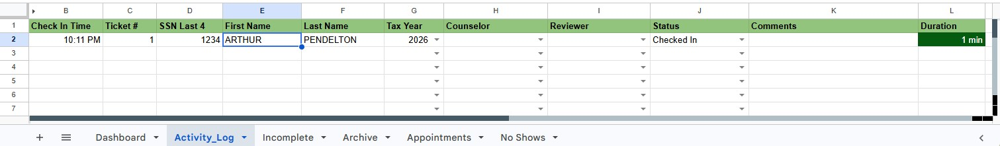

<b>Figure 5 - Checking In a Taxpayer on the Activity Log Tab</b>

## 🗺️ Chapter 3: The Tax Preparation Process

As per IRS and AARP policy, every tax return should be prepared by a certified counselor and reviewed by another certified reviewer. The system enforces this policy by presenting two dropdown lists, one for counselors and one for reviewers. The names of the counselors and reviewers on those lists are electronically pushed into the system by the District Administration Coordinators whose role is to oversee the certification process.

### 3.1 The Tax Counselor Process

When the taxpayer is ready to be seen by a counselor and a counselor is available, the greeter will introduce the taxpayer to the counselor. The greeter will then select the counselor's name from the dropdown list . The system will change the status of the tax return to **"Assigned"**. The row will be highlighted in yellow. See Figure 5.

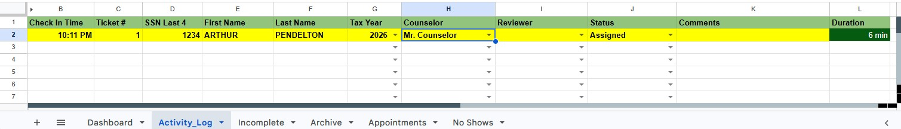

<b>Figure 6 - Assigning a Counselor</b>

While the Counselor is preparing the tax return with the taxpayer, the status remains **"Assigned"**. Once a counselor has completed the preparation of the tax return, they must change the status to **Ready for Review**, indicating that a reviewer may pick up the return for review and completion. The system will highlight the row in light orange. See Figure 6.

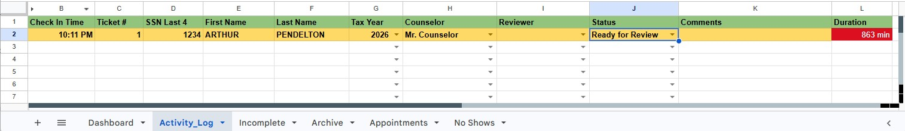

<b>Figure 7 - Ready for Review</b>

#### 3.1.1 Handling Exceptions - No Return, Incomplete and Deactivation

In some cases, during the initial discussion with the taxpayer, the counselor and taxpayer may reach the conclusion that a tax return should not be prepared. If the tax return has not yet been started in TaxSlayer, the counselor will assign a status of **"No Return"** and state the reason for this decision - see Figure 2. The system will then transfer the record from the Activity Log to the Archive.

If the counselor has started the return preparation in TaxSlayer and later determines that the tax return cannot be completed, but the taxpayer intends to come back and complete the tax return, they should mark the status as **"Incomplete"** and state the reason for the incompletion - see Figure 2. More on the **Incomplete** state and the completion of ****Incomplete** returns later in the manual. 

The counselor and taxpayer may also decide to abandon the tax return process. In this case the counselor marks the status as **"Deactivated"**, states the reasons - see Figure 2 - and deactivates the return in TaxSlayer. Since **Deactivated** is a terminal state, the system will transfer the tax return from the Activity_Log into the Archive tab.

### 3.2 The Quality Reviewer Process

Tax-Aide Quality Reviewers are experienced tax counselors who are authorized by their Local Coordinator (site leader) to review tax returns prepared by counselors. Typically, quality reviewers also act as Electronic Return Originators (EROs) who are authorized to e-file a tax return with the IRS. This manual assumes that a quality reviewer is also an ERO.

Once a quality reviewer is assigned to the tax return, by picking a quality reviewer name from the Reviewer column, the system will automatically advance the status to **In Review**, highlight the row in brown. See Figure 8.

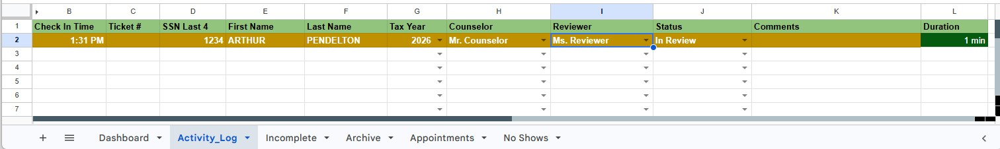

<b>Figure 8 - In Review</b>

While the quality reviewer is reviewing the tax return with the taxpayer, the status remains **"In Review"**. Once a quality reviewer has completed the review of the tax return, the typical next step is to go over the completed return with the taxpayer and obtain their written consent for electronically filing the return with the IRS using form 8879. Once the consent was obtained and the tax return e-filed, the quality reviewer marks the return as e-filed and the system will highlight the row in cyan. See Figure 9.

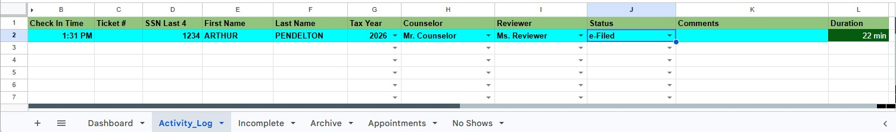

<b>Figure 9 - e-Filed</b>

#### 3.2.1 Handling Exceptions

As is the case with the tax counselor, should the quality reviewer determine that the tax return cannot be completed at this time, but the taxpayer intends to come back and complete the tax return, they should mark the status as **"Incomplete"** and state the reason for the incompletion - see Figure 2. More on the **Incomplete** state and the completion of ****Incomplete** returns later in the manual. The quality reviewer and taxpayer may also decide to abandon the tax return process. In this case the quality reviewer marks the status as **"Deactivated"**, states the reasons - see Figure 2 - and deactivates the return in TaxSlayer. Since **Deactivated** is a terminal state, the system will transfer the tax return from the Activity_Log into the Archive tab.

### 2.7 Accepted

The normal progression of a tax return from an **e-Filed** state is to be **Accepted** by the IRS. This typically happens within 30 minutes of the tax return being filed as is being tracked by the Shift Coordinator using the TaxSlayer system. The Shift Coordinator will then change the status of the return to **Accepted**. The system will timestamp this transition in the "Latest Status Change" column K and highlight the row in green. See Figure 9.

<figure>
   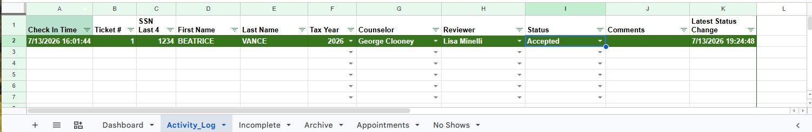
   <figcaption align="center">Figure 9 - Accepted State </figcaption>
</figure>

An **Accepted** state cannot be changed and will be archived on the Archive tab as part of the "End-of-Day" process.

### 2.8 IRS Rejection

Occasionally, the IRS will reject an electronic filing of a tax return for a variety of reasons. The Shift Coordinator will typically find out about a rejection within approximately 30 minutes of the filing. By that time the taxpayer will not be available in person at the site and the Shift Coordinator will attempt to reach out to the taxpayer to try to resolve any discrepancy.

When an IRS rejection occurs, the Shift Coordinator will change the status of the tax return to **Rejected**. The system will then present a dialog requiring the Shift Coordinator to enter a reason for the rejection and/or any additional comments. The system will timestamp this transition in the "Latest Status Change" column K and highlight the row in red. See Figure 10.

<figure>
   
   <figcaption align="center">Figure 10 - Rejection State</figcaption>
</figure>

Under certain circumstances an IRS rejection can be cured by refiling the tax return. This is typically done by the Shift Coordinator.

### 2.9 Incompletion

A tax return may be assigned an **Incomplete** status in cases where the tax return was started but cannot be completed during the daily session. Such assignment can be made by any Tax-Aide volunteer. Typically, this happens when the taxpayer did not provide all the document necessary for completing the tax return.

An assignment of this state requires the operator to state a reason for the incompletion, which the system then records in the comments section (column J). The system will timestamp this transition in the "Latest Status Change" column K and highlight the row in grey. See Figure 11. 

<figure>
   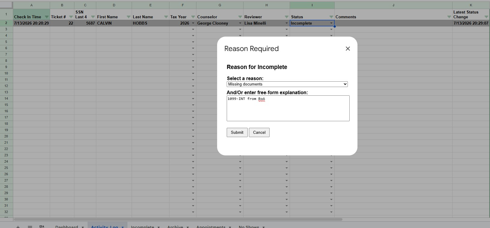
   <figcaption align="center">Figure 11 - Incomplete State</figcaption>
</figure>

### 2.10  No Return

All clients who show up at a Tax-Aide site must be checked into the system, whether they want their tax returns filed or just seek advice. This is a requirement of the Tax-Aide program's host sites, who need to know how many people were served by the program's services. This is also of interest to the Tax-Aide program.

Occasionally, a taxpayer may decide to not proceed with the preparation of a tax return. In such case, the volunteer should set the status of the record to **No Return**. At the end of the daily shift, this record will be archived and will become part of the site's required statistics. A **No Return** status can be set by a greeter or counselor at any time before initiation of a tax return in TaxSlayer. When setting a record to a **No Return** state, the system will prompt the operator to select a reason (e.g. "Inquiry Only" or "Out of Scope"). A status of a record in a **No Return** state may not be changed. See Figure 12.

<figure>
   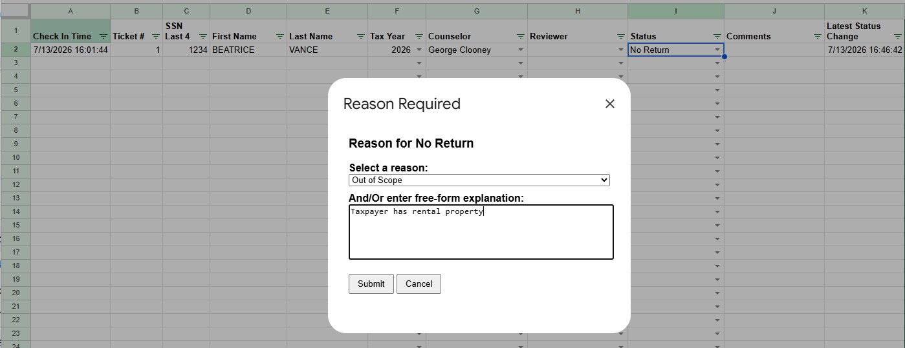
   <figcaption align="center">Figure 12 - No Return State with Reason Required Dialog</figcaption>
</figure>

### 2.11  Complete

The tax return may be assigned a **Completed** state if the tax return is ready to be filed, but for a variety of reasons it is being placed on hold until a later time. Typically, a **Completed** state is a precursor to **Paper** filing of a tax return. See Figure 13.

<figure>
   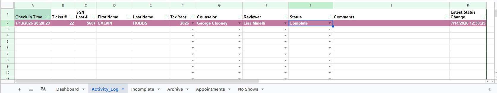
   <figcaption align="center">Figure 13 - Complete State
   </figcaption>
</figure>

### 2.12  Paper Returns

The AARP Tax-Aide program's primary goal is to prepare tax returns for electronic filing. This speeds up the filing and tax refund process, save paperwork and eases the burden on IRS resources. However, occasionally there is a need to file a tax return in paper form. Preparing a return to be filed in **Paper** form requires the approval of the Shift Coordinator.

The **Paper** state of a tax return is typically set by the quality review or the Shift Coordinator by simple choosing **Paper** from the Status dropdown (column I). This state is "termina", namely the system will not permit a transition out of this state. The system will enforce stating a reason for a **Paper** return to be filed. **Paper** tax returns will be automatically archived to the Archive tab at the end-of-day process. See Figure 14.

<figure>
   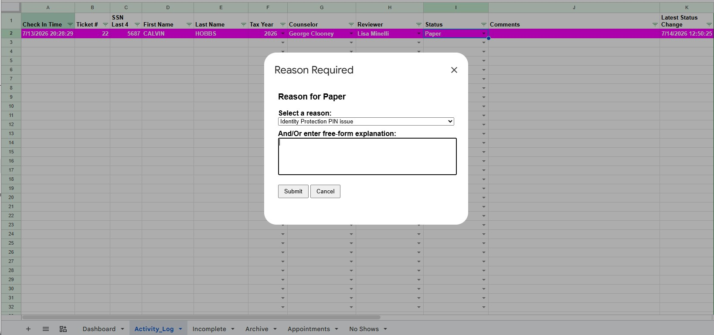
   <figcaption align="center">Figure 14 - Paper State
   </figcaption>
</figure>

## 🗺️ Section 3: End-of-day Process

The previous section discussed the workflow at the Tax-Aide site during a typical daily session. After the conclusion of the daily activities, the system must be prepared for future operations. This is accomplished by an automated script which is initiated by the Shift Coordinator as follows:

* Click the "TaxAide" Menu.
* Choose the End Of Day Process menu item.
* Confirm by clicking "Yes" on the "Confirm End of Day Process" dialog. See Figure 15.

The script executes the following operations:

* Archives all the tax returns in a "terminal" state to the Archive tab.
* Transfers all tax returns that are yet to be completed to an Incomplete tab
* Clears the Activity Log tab
* At Appointment sites - transfers all "no show" appointments to a "No Shows" tab.

<figure>
   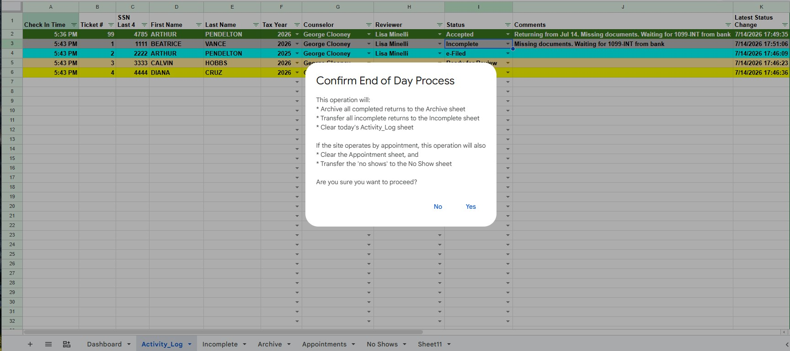
   <figcaption align="center">Figure 15 - End of Day Process</figcaption>
</figure>

## 🗺️ Section 4: Continuing Incomplete Tax Returns

Incomplete tax returns are listed in the Incomplete tab. When a taxpayer returns to the site to complete their tax return, the greeter will search for the record using the filters at the headers any of the columns. When the greeter finds the taxpayer's record, they will click the "Transfer to Activity Log" checkbox (column A). See Figure 16.

The system will confirm that the incomplete tax return record was transferred to the Activity Log tab, listing the taxpayer's name, the counselor who previously worked on this tax return, the date the taxpayer was previously at the site, any comments that were previously added to the record and the date and time the state of the tax return was last changed. The system will also assign the tax return ticket number 99 to indicate that this is a returning taxpayer. From this point the incomplete tax return is processed normally using the Activity Log tab. See Figure 16.

<figure>
   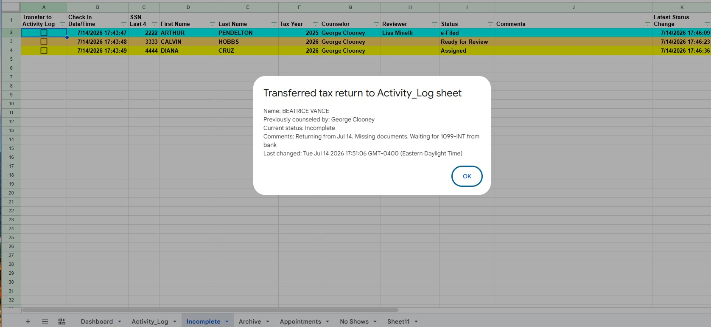
   <figcaption align="center">Figure 15 - Transfer from Incomplete to Activity Log</figcaption>
</figure>

## 🗺️ Section 5: Archiving Completed Tax Returns

The End-of-Day process archives all tax returns in a "terminal" state to the Archive tab. It includes all tax returns in the following states:

* Approved by the IRS
* Paper tax returns
* Deactivated tax returns
* No Return taxpayer interactions.

The archive serves as the database underlying the site's Dashboard and can be sorted by any of the columns.Column K shows the duration from check-in to the completion time. See Figure 16.

<figure>
   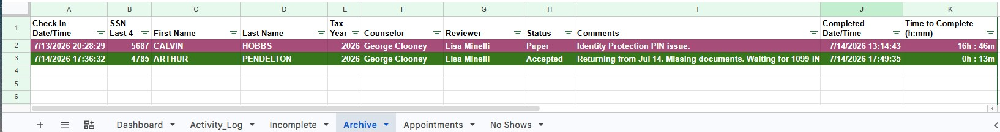
   <figcaption align="center">Figure 16 - The Archive Tab</figcaption>
</figure>

## 🗺️ Section 6: No Shows

## 🗺️ Section 7: The Dashboard

